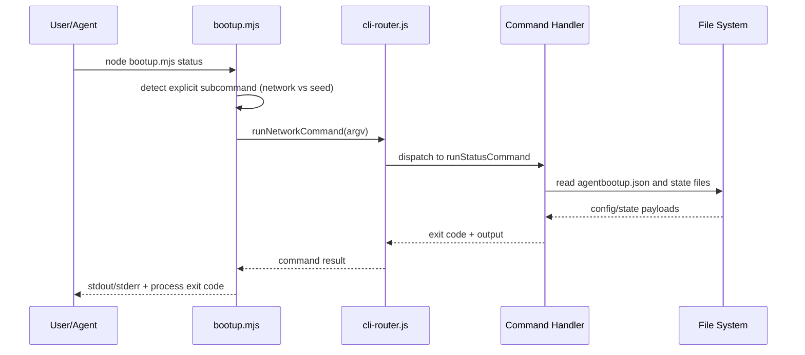
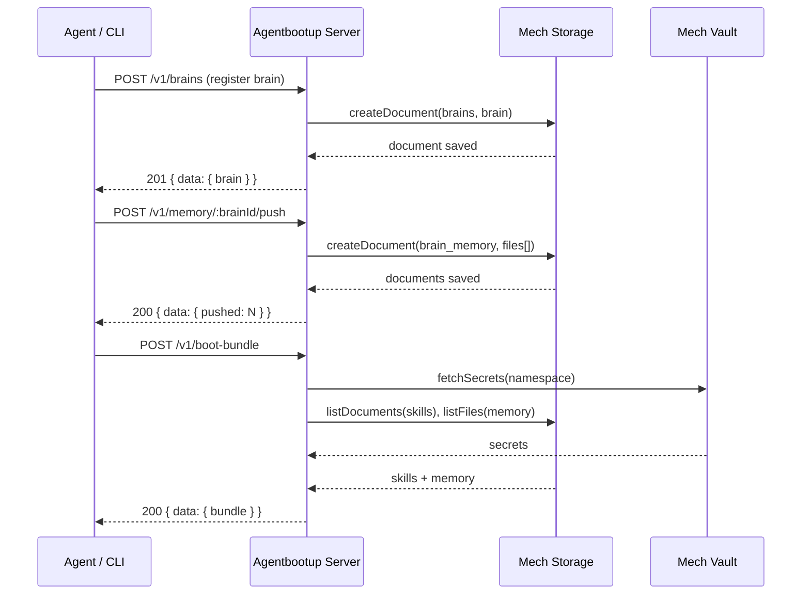
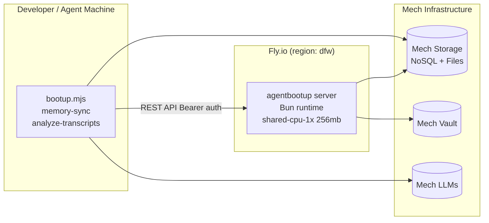

<!-- GENERATED: docs-generator | 2026-07-19 | v0.8.27 -->
# Architecture: agentbootup

> CLI-first bootstrap and network lifecycle manager for AI agent repos, with a hosted HTTP server for brain registry, memory sync, skill distribution, and transcript storage.

## System Overview

`agentbootup` operates in two distinct layers:

**CLI layer** — Node.js ESM tools running locally on developer/agent machines:
- **Seed mode** (`bootup.mjs`): copies template assets (agents, skills, commands, docs, workflows) into a target repository.
- **Network mode** (`cli-router.js`): routes operational commands to manage multi-project network workflows, including sync, provisioning, trust management, transcript distribution, and **environment-scoped** workflows via `environments/<name>.json` (`install --env`, `provision --env`, `status --env`, `doctor --env`).
- **Unified Daemon** (`lib/daemon/unified-daemon-cli.js`): manages background sync agents via `@derivativelabs/agent-process` — `agentbootup-transcripts` (transcript sync, port 8766), one or more `agentbootup-brain-<id>` instances (brain asset sync), `agentbootup-brain-db-<id>` (brain.db sync, per provisioned project), `agentbootup-inbox-<id>` (inbox wake-on-message, per provisioned project), and custom project daemons (`agentbootup-{name}-{projectId}`). In single-brain mode, uses a single `agentbootup-brain` process. In multi-brain mode (network root configured), spawns one process per project from the network config. After the transcript-indexing stage in network/multi-brain mode, startup can run the project-owned `brain/scripts/narrative-generator.ts` once daily for each provisioned brain-db project's missing narrative (`--no-narrative` skips it; `--no-brain-db` removes the eligible project list; the retired `brain/narrative-generator.ts` path is the only compatibility fallback). The single-brain fallback does not currently create these project entries. Accessible via `agentbootup daemon start|stop|status|logs`. The `--skills-mode=static|mech-storage` flag persists the skill projection backend used by the brain-asset-sync daemon.
- **Daemon Registry** (`lib/daemon/daemon-registry.js`): canonical registry of all daemon entry builders. Exports `getBrainAgentEntries`, `getBrainDbAgentEntries`, `getInboxAgentEntries`, `getCustomAgentEntries`, and `getNetworkProjects`. Custom brain daemons are declared per-project in `brain/daemons.json`; env vars follow the `AGENTBOOTUP_<SERVICE>_<PROPERTY>` convention. **Multi-machine partial install**: all four per-project builders skip entries whose `path` is not present on disk (`fs.existsSync` guard); brain asset-sync allows path-less entries. **Machine routing**: `AGENTBOOTUP_MACHINE_ID = os.hostname()` is injected into every per-project (multi-brain) daemon entry env (resolved once at module load); the single-brain fallback entry in `getBrainAgentEntries` has no env object and does not receive this var. **Inbox opt-in**: `getInboxAgentEntries` requires `inboxEnabled.{agentId}: true` in `~/.agentbootup/config.json`; auto-migrates projects with pre-existing port+secret.
- **Skill Projection** (`lib/skill-projection/`): manages skill storage backends and projects per-tenant `CLAUDE.md` files. `StaticBackend` is read-only (`.claude/skills/`); `MechStorageBackend` is the canonical cloud store (`{agentId}-skills` collections). `SkillProjector` generates `CLAUDE.md` atomically with hash-based no-op and orphan cleanup. **Skills CLI** (`lib/network/commands/skills.js`): local FTS index in `brain.db`, `skills push|pull|diff` against `GET/POST /v1/brain-assets`, and `skills migrate --from static --to mech-storage`.
- **memory-sync**: synchronizes agent memory files to Mech Storage (push/pull/watch).
- **analyze-transcripts**: LLM-powered extraction of insights from Claude Code session transcripts, written to project memory files.

**Agent Process** (`@derivativelabs/agent-process`) — library-first daemon lifecycle manager:
- Abstracts launchd (macOS), systemd (non-WSL Linux), and pm2 (Windows, WSL, and unrecognized platforms) behind a unified TypeScript API.
- `agentStart/Stop/Restart/Status/Fleet/Logs/Uninstall` functions manage platform-native service registration.
- `createAgent` / `AgentServer` provide an in-process HTTP server framework for brain daemons.
- `HeartbeatService`, `MessageService`, `ADMPTransport` are built-in for standard brain protocols.

**Server layer** — Bun.serve HTTP API deployed on Fly.io (`src/server/`):
- Brain registry (PostgreSQL via Mech NoSQL)
- Memory sync (Mech NoSQL per-brain collections)
- Skill registry (Mech NoSQL)
- Transcript storage (Mech Files, chunked upload support)
- Brain DB provisioning (per-brain Ed25519 JWT for sqld auth)
- Tool registry and boot bundle assembly

## Component Diagram

```mermaid
graph TB
    User[User/Agent CLI Call] --> Bootup[bootup.mjs]
    Bootup --> Seed[Template Seeder]
    Bootup --> Router[Network CLI Router]

    Seed --> Templates[(templates/**)]
    Seed --> Target[(Target Project FS)]

    Router --> Commands[Network Commands]
    Commands --> NetCfg[(agentbootup.json)]
    Commands --> Git[Git CLI]
    Commands --> TranscriptCLI[(.agentbootup-transcripts)]

    MemSync[memory-sync] --> SyncMgr[MemorySyncManager]
    SyncMgr --> MechStorage[(Mech Storage\nhttps://storage.mechdna.net)]
    SyncMgr --> MemoryFiles[(memory/MEMORY.md\nmemory/daily/**)]

    Daemon[memory-sync-daemon] --> DaemonCore[MemorySyncDaemon]
    DaemonCore --> HttpServer[HTTP API :8765]
    DaemonCore --> SyncMgr

    DaemonCLI["daemon CLI\nstart/stop/status/logs\n--skills-mode=static|mech-storage"] --> DaemonRegistry["daemon-registry.js\ngetBrainAgentEntries\ngetBrainDbAgentEntries\ngetInboxAgentEntries\ngetCustomAgentEntries"]
    DaemonRegistry --> AgentProcess["@derivativelabs/agent-process\nlaunchd | systemd | pm2"]
    AgentProcess --> TranscriptDaemon["agentbootup-transcripts\ntranscript-sync.mjs :8766"]
    AgentProcess --> BrainDaemon["agentbootup-brain-*\nbrain-asset-sync.mjs\nno dedicated port"]
    AgentProcess --> BrainDbDaemon["agentbootup-brain-db-*\nbrain-db-sync.mjs\nper provisioned project"]
    AgentProcess --> InboxDaemon["agentbootup-inbox-*\ninbox-daemon.mjs\n:8767-8867"]
    AgentProcess --> CustomDaemon["agentbootup-{name}-{projectId}\nbrain/daemons.json custom"]
    TranscriptDaemon --> CliDirs[("~/.claude/projects\n~/.codex/sessions\n~/.gemini/tmp\n~/.cursor/projects")]
    TranscriptDaemon -->|POST /v1/sync/transcripts/push| Server
    BrainDaemon -->|POST /v1/brain-assets/:brainId/push| Server
    SecretsCLI["secrets push/pull\nmanual only"] -->|GET capabilities, explicit secret POST/GET, verifier DELETE cleanup| Server
    BrainDbDaemon -->|sqld libSQL sync| RemoteDB[(Remote sqld DB)]

    SkillMigrate["skills migrate\n--from static\n--to mech-storage"] --> StaticBE["StaticBackend\n.claude/skills/"]
    SkillMigrate --> MechBE["MechStorageBackend\n{agentId}-skills collection"]
    SkillProjector["SkillProjector\ngenerates CLAUDE.md"] --> StaticBE
    SkillProjector --> MechBE
    MechBE --> MechStorage

    ATX[analyze-transcripts] --> TranscriptParser[TranscriptParser]
    ATX --> InsightExtractor[InsightExtractor]
    InsightExtractor --> MechLLMs[(Mech LLMs\nhttps://llms.mechdna.net)]
    ATX --> MemWriter[MemoryWriter]
    MemWriter --> MemoryFiles

    subgraph agentProcess["@derivativelabs/agent-process"]
        AgentLib[Library API\nagentStart/Stop/Status/Fleet]
        PlatformMgr[ProcessManager\nlaunchd | systemd | pm2]
        AgentSvr[AgentServer\nHTTP daemon framework]
        AgentLib --> PlatformMgr
        AgentLib --> AgentSvr
    end

    PlatformMgr --> OS[Platform Service\ncom.dundas.* / dundas-*]
    AgentSvr --> BootBundle[Boot Bundle\nfrom /v1/boot-bundle]
    AgentSvr -.-> StagingBundle[Static staging runtime bundle\nschemas/staging-bundle.json]

    subgraph "Agentbootup Server (Fly.io :3000)"
        Server[Bun.serve\nsrc/server/server.ts]
        BrainStore[BrainStore]
        SkillStore[SkillStore]
        MemStore[MemoryStore]
        RegStore[RegistryStore]
        TxStore[TranscriptStore]
        BrainAssetStore[BrainAssetStore]
        BundleBuilder[BundleBuilder]
        RuntimeSchema[brain-runtime-v1 schema + validator]
        MechClient[MechClient]
        VaultClient[VaultClient]

        Server --> BrainStore
        Server --> SkillStore
        Server --> MemStore
        Server --> RegStore
        Server --> TxStore
        Server --> BrainAssetStore
        Server --> BundleBuilder
        BrainStore --> MechClient
        SkillStore --> MechClient
        MemStore --> MechClient
        RegStore --> MechClient
        TxStore --> MechClient
        BrainAssetStore --> MechClient
        BundleBuilder --> VaultClient
        BundleBuilder --> SkillStore
        BundleBuilder --> MemStore
        BundleBuilder --> RegStore
        RuntimeSchema -. validates .-> StagingBundle
    end

    MechClient --> MechStorage
    VaultClient --> MechVault[(Mech Vault\nhttps://vault.mechdna.net)]
```

## CLI Data Flow

Primary local execution path (no server required):



## Server Data Flow

Server API path (requires `AGENTBOOTUP_API_KEY`):



## Deployment Topology



## Services

### `src/server/server.ts` — Agentbootup HTTP Server
- **Runtime**: Bun (`oven/bun:1` Docker image)
- **Deployment**: Fly.io, region `dfw`
- **Port**: 3000 (HTTPS enforced by Fly.io proxy)
- **Scaling**: min 1 machine; auto-start/stop; hard limit 100 connections
- **Auth**: Bearer token (`AGENTBOOTUP_API_KEY`) on all routes except `GET /health`
- **Dependencies**: Mech Storage (NoSQL + Files), Mech Vault
- **Responsibilities**:
  - Brain registry CRUD (`/v1/brains`)
  - Skill registry CRUD (`/v1/skills`)
  - Memory push/pull (`/v1/memory/:brainId/push|pull`)
  - Shared brain-asset validation plus non-mutating capability preflight (`GET /v1/brain-assets/:brainId/capabilities`)
  - Atomic committed secret generations with canonical expiry, explicit pull/cleanup isolation, and unconditional exclusion from generic boot bundles
  - Brain asset hash inventory (`GET /v1/brain-assets/:brainId/hashes`)
  - Boot bundle assembly (`/v1/boot-bundle`)
  - Brain DB provisioning (`POST /v1/brain-db/provision`)
  - Tool registry search and publish (`/v1/registry/*`)
  - Manifest management (`/v1/manifest`)
  - Network config storage (`/v1/network-config`)
  - Runtime lease ownership (`POST /v1/agents/:agentId/wake`, `GET /v1/agents/:agentId/runtime_address`)
  - AgentHostRuntimeSpec composition from agent, bundle, lease, and placement context

Runtime boundary contract: agentbootup owns wake/resume decisions, runtime lease persistence, and canonical `runtime_address` publication. Agenthost defines the runtime envelope. Mech-machines only acquires generic machine substrate, and AgentAnything/mech-plane consume `runtime_address` instead of reconstructing endpoints.

Runtime leases use deterministic hashed Mech NoSQL document IDs keyed by agent ID. The server also serializes same-agent wake handling in-process; cross-instance writes converge on the deterministic lease document with last-writer-wins semantics until a stronger storage compare-and-set primitive exists. On create conflicts, the existing `createdAt` is preserved.

### `@derivativelabs/agent-process` (`packages/agent-runtime`)
- **Runtime**: Bun / Node.js (ESM)
- **Type**: Library package (`@derivativelabs/agent-process`)
- **Version**: 2.1.1
- **Platform support**: launchd (macOS), systemd (non-WSL Linux), pm2 (Windows, WSL, unrecognized)
- **Responsibilities**:
  - Unified `agentStart/Stop/Restart/Status/Fleet/Logs/Uninstall` library API
  - Platform-native service registration (plist / unit / pm2 config)
  - In-process `AgentServer` HTTP framework for brain daemons
  - Built-in `HeartbeatService`, `MessageService`, `ADMPTransport`
  - `defineAgent` config factory for `agent.config.ts` pattern
  - Agent name validation: alphanumeric + hyphens, ≤ 64 chars

### `bootup.mjs`
- **Runtime**: Node.js (ESM), `>=18`
- **Type**: CLI entrypoint
- **Responsibilities**:
  - Parse seed-mode options (`--target`, `--subset`, `--platform`, etc.)
  - Decide seed-mode vs network-command routing
  - Execute file copy + fragment append logic

### `lib/network/cli-router.js`
- **Runtime**: Node.js module
- **Type**: command dispatcher
- **Responsibilities**:
  - Validate command namespace
  - Dispatch to individual network command modules
  - Print network command help surface
  - Registers `install` alongside other network verbs (`isNetworkCommand`)

### `lib/network/env-manifest.js`
- **Runtime**: Node.js (ESM)
- **Type**: library
- **Responsibilities**: Load `environments/<name>.json` at the network root; validate `id` vs filename, schema version, duplicate-free `projects`, optional `install_order` permutation; cross-check every id against `agentbootup.json` `projects[]`.

### `lib/network/commands/*`
- **Runtime**: Node.js modules
- **Type**: task-oriented command handlers
- **Responsibilities**:
  - Network status/doctor checks
  - Sync/pull/provision/trust/watch lifecycles
  - Env synchronization
  - Transcript sync/restore/index operations
  - Skills migration (`lib/network/commands/skills.js`) — `agentbootup skills migrate`

### `lib/daemon/daemon-registry.js` — Daemon Registry
- **Runtime**: Node.js (ESM)
- **Type**: module / library
- **Responsibilities**:
  - Enumerate all daemon entry builders (brain, brain-db, inbox, custom)
  - Load and validate network config projects
  - Parse per-project `.env` files for brain.db credentials
  - Allocate inbox ports and provision webhook secrets (on the start path)
  - Read and validate `brain/daemons.json` declarations for custom daemons
  - Enforce custom daemon safety rules: name sanitization, path traversal guard, duplicate name rejection
- **Exported functions**: `getBrainAgentEntries`, `getBrainDbAgentEntries`, `getInboxAgentEntries`, `getCustomAgentEntries`, `getNetworkProjects`, `SCRIPTS`
- **Custom daemon env convention**: `AGENTBOOTUP_<SERVICE>_<PROPERTY>`

### `lib/skill-projection/` — Skill Projection Module
- **Runtime**: Node.js (ESM)
- **Type**: library
- **Exported from**: `lib/skill-projection/index.js`
- **Backends**:
  - `StaticBackend` — read-only; maps `{projectRoot}/.claude/skills/` directory tree. Each subdirectory with a `SKILL.md` is one skill. Deterministic ID = SHA-256 of `"{projectRoot}\0{skillName}"`. All skills master-scoped. Write methods throw.
  - `MechStorageBackend` — canonical read/write cloud backend. Collections: `{agentId}-skills`, `{agentId}-skill-versions`, `{agentId}-agent-configs`. `isEmptyStore()` for fail-fast daemon startup checks. Wraps all errors as `MechStorageError` (`UNAUTHORIZED` | `UNAVAILABLE`).
- **SkillProjector**: assembles `CLAUDE.md` for a tenant from master + tenant skills (sorted, deduplicated). Writes atomically via `tmp → rename`. Hash-based no-op (skips disk write when content unchanged). `syncAllTenantsToDisk()` removes orphan tenant directories.
- **Version management** (`versions.js`): `nextVersionNum`, `trimVersions(versions, keep=20)`, `buildVersionEntry(skillId, name, content, savedBy, note?)` — pure helpers.
- **Responsibilities**:
  - Provide pluggable skill storage backends
  - Generate per-tenant `CLAUDE.md` projections
  - Version history (snapshot before mutation; trim to 20 per skill)
  - Path traversal guard in `SkillProjector._resolveTenantDir()`

### `lib/daemon/unified-daemon-cli.js` — Unified Daemon CLI
- **Runtime**: Node.js (ESM), `>=18`
- **Type**: CLI entrypoint for `agentbootup daemon` subcommands
- **Responsibilities**: consent gate, credential pre-validation, dispatches to `agentStart`/`agentStop`/`agentStatus`/`agentLogs` from `@derivativelabs/agent-process`; reads daemon entries from `daemon-registry.js`

### `lib/daemon/transcript-sync.mjs` — Transcript Sync Daemon
- **Runtime**: Bun (invoked via `@derivativelabs/agent-process`)
- **Type**: long-running background process (launchd/systemd/pm2 managed)
- **Port**: 8766 (health HTTP server, localhost only; override: `AGENTBOOTUP_DAEMON_PORT`)
- **PID file**: `~/.agentbootup/daemon/transcript-sync.pid`
- **Log file**: `~/.agentbootup/daemon/transcript-sync.log`
- **Sync state**: `~/.agentbootup/sync-state.json` (versioned canonical transcript offsets plus persisted transcript failure metadata)
- **Responsibilities**:
  - Watch AI CLI transcript directories via `fs.watch` (macOS/Windows/Linux Node≥22) + 30s polling fallback
  - Phase-0 containment sends only complete files at offset zero; growing files with legacy offsets and files over 4 MiB fail closed until archive v2 can create a verified immutable generation
  - Split multi-file push batches under a configurable encoded-body ceiling and reject any single encoded item over that ceiling before network I/O
  - Persist per-file 5xx retry state with bounded exponential backoff and a slow retry lane after repeated failures
  - Health server exposes `GET /health` and `GET /status` on localhost, separating process liveness from backup health; legacy v1 remains `blocked_durability` because inventory presence is not archive authority
  - Graceful shutdown: wait for in-flight sync, perform final flush on SIGTERM/SIGINT
  - Transcript sync machine ID: stable UUID at `~/.agentbootup/machine-id` via `getMachineId()` (not hostname)
  - Daemon routing machine ID: `AGENTBOOTUP_MACHINE_ID = os.hostname()` injected into all per-project (multi-brain) daemon entry envs; single-brain fallback entry has no env object and does not receive this var
  - Managed service log files are rotated before daemon start using the same service-manager log targets the install owns (launchd file paths, pm2 out/error files, direct `~/.agentbootup/daemon/*.log`; journald-backed systemd units are explicit no-file-target skips)

### `memory-sync` / `lib/sync/*`
- **Runtime**: Node.js (ESM), `>=18`
- **Type**: CLI + library
- **Responsibilities**:
  - Bidirectional sync of memory files to Mech Storage
  - Config management (`SyncConfigManager`)
  - Sync operations (`MemorySyncManager`)
  - Daemon lifecycle management (`DaemonManager`)

### `lib/daemon/brain-asset-sync.mjs` — Brain Asset Sync Daemon
- **Runtime**: Bun (invoked via `@derivativelabs/agent-process`)
- **Type**: long-running background process (launchd/systemd/pm2 managed)
- **Modes**:
  - **Single-brain**: one `agentbootup-brain` daemon
  - **Multi-brain**: one `agentbootup-brain-<id>` daemon per project
- **State**: `~/.agentbootup/brain-sync-state-<agentId>.json` (per-brain)
- **Responsibilities**:
  - Watch brain asset directories (skills, agents, commands, memory, protocols, config, scripts)
  - Push asset changes to `POST /v1/brain-assets/:brainId/push`
  - Each daemon receives `AGENTBOOTUP_BRAIN_ID`, `AGENTBOOTUP_PROJECT_ROOT`, and `AGENTBOOTUP_SKILLS_MODE` via environment
  - `AGENTBOOTUP_SKILLS_MODE=static` (default) reads skills from local `.claude/skills/`; `mech-storage` uses the cloud `MechStorageBackend`
  - Under `agentbootup daemon`, brain observability is via `daemon status` and `daemon logs`, not per-brain HTTP health ports

### `analyze-transcripts` / `lib/analysis/*`
- **Runtime**: Node.js (ESM), `>=18`
- **Type**: CLI
- **Responsibilities**:
  - Discover and parse Claude Code session transcripts
  - LLM-powered insight extraction via Mech LLMs
  - Write daily logs and update `memory/MEMORY.md`
  - State tracking to avoid reprocessing sessions

## Storage

### Transcript archive authority and local retention

Archive v2 keeps immutable content blobs, manifests, signed receipts, restore/verification audit records, and a restrictive local ledger as distinct layers. The daemon is optional: manual backup, status, verification, inventory reconstruction, and restore call the authenticated service directly. The default `localRetention.mode` is `keep_all`, and no timer or daemon path deletes native harness files.

The local offload planner is intentionally not an authority boundary. Its short-lived plan binds sanitized path identity, stable file hash/stat identity, archive version, receipt, verification evidence, harness observation, and expiry. Production remains `PAUSE`, so all rows are retained and `--apply` has no deletion implementation. A future deletion path must revalidate the live committed generation and full restored bytes, plus versioning, replication, independent catalog recovery, retention/export/account-closure guarantees, before deleting one enumerated regular file.

| Location | Type | Purpose |
|----------|------|---------|
| `agentbootup.json` | Local file | Network/project configuration source-of-truth |
| `.agentbootup-vault/` | Local directory | Local secret backup artifacts (written by portability utilities, not the main CLI command path) |
| `.agentbootup-transcripts/` | Local directory | Transcript cloud-root simulation and analysis state |
| `.agentbootup-watch.json` | Local file | Watch lifecycle state |
| `memory/MEMORY.md` | Local file | Long-term agent memory (human and AI readable) |
| `memory/daily/YYYY-MM-DD.md` | Local file | Per-session logs written by analyze-transcripts |
| `.transcript-analyzer-state.json` | Local file | Processed session tracking for analyze-transcripts |
| `brain/daemons.json` | Local file (per project) | Custom daemon declarations for the project brain |
| Mech NoSQL (`brains` collection) | Cloud | Brain registry documents |
| Mech NoSQL (`skills` collection) | Cloud | Skill files and metadata |
| Mech NoSQL (`<brain>_memory` collection) | Cloud | Per-brain memory files |
| Mech NoSQL (`transcript_chunks_<hash>`) | Cloud | Staged transcript chunks during chunked upload assembly (ephemeral — documents are deleted after final chunk assembles the file) |
| Mech Files (`transcripts/{brainId}/{machineId}/{cli}/{filename}`) | Cloud | Assembled AI session transcript files |
| Mech Vault (`<namespace>`) | Cloud | Secrets for boot bundle assembly |

## External Integrations

| Integration | Auth | Purpose |
|-------------|------|---------|
| **Git CLI** | SSH/HTTPS credentials | Project sync and commit workflows |
| **Package managers** (`npm`, `bun`) | None | Conditional dependency install in `pull --install` |
| **Mech Storage** (`https://storage.mechdna.net`) | `MECH_APP_ID` + `MECH_API_KEY` | NoSQL and Files storage for all server state; memory-sync |
| **Mech Vault** (`https://vault.mechdna.net`) | `MECH_APP_ID` + `MECH_API_KEY` | Secret fetch for boot bundle assembly |
| **Mech LLMs** (`https://llms.mechdna.net`) | `MECH_APP_ID` + `MECH_API_KEY` | LLM inference for analyze-transcripts insight extraction |

## Environment Variables

| Variable | Required By | Required | Default | Description |
|----------|-------------|----------|---------|-------------|
| `AGENTBOOTUP_API_KEY` | server | Yes | — | Bearer token for server API authentication |
| `MECH_APP_ID` | server, memory-sync, analyze-transcripts | Yes | — | Mech platform app ID |
| `MECH_API_KEY` | server, memory-sync, analyze-transcripts | Yes | — | Mech platform API key |
| `MECH_API_SECRET` | server | Yes | — | Mech platform API secret (server only) |
| `MECH_STORAGE_URL` | server, memory-sync, skills migrate | No | `https://storage.mechdna.net` | Override Mech Storage URL |
| `MECH_MAX_ENUMERATION_RECORDS` | server | No | `100000` | Fail-closed raw-record budget for complete generic NoSQL enumeration (maximum `1000000`) |
| `MECH_VAULT_URL` | server | No | `https://vault.mechdna.net` | Override Mech Vault URL |
| `MECH_LLM_URL` | analyze-transcripts | No | `https://llms.mechdna.net` | Override Mech LLMs URL |
| `AGENTHOST_RUNTIME_IMAGE` | server | No | `ghcr.io/dundas/agenthost:latest` | Agenthost image used when composing AgentHostRuntimeSpec |
| `AGENTHOST_RUNTIME_PORT` | server | No | `8787` | Agenthost HTTP port used when composing AgentHostRuntimeSpec |
| `AGENTHOST_RUNTIME_HEALTH_PATH` | server | No | `/health` | Agenthost health endpoint path used when composing AgentHostRuntimeSpec |
| `AGENTHOST_RUNTIME_HEALTH_INTERVAL_SECONDS` | server | No | `5` | Agenthost health check interval used when composing AgentHostRuntimeSpec |
| `AGENTHOST_RUNTIME_HEALTH_TIMEOUT_SECONDS` | server | No | `2` | Agenthost health check timeout used when composing AgentHostRuntimeSpec |
| `AGENTHOST_RUNTIME_CPU` | server | No | `shared-1` | Agenthost CPU resource hint used when composing AgentHostRuntimeSpec |
| `AGENTHOST_RUNTIME_MEMORY_MB` | server | No | `2048` | Agenthost memory resource hint used when composing AgentHostRuntimeSpec |
| `PORT` | server | No | `3000` | HTTP listen port |
| `HOST` | server | No | `0.0.0.0` | HTTP listen host |
| `AGENTBOOTUP_SKIP_STARTUP_BACKFILL` | server | No | `0` | **Emergency escape hatch, not a default.** Set to `1` to skip the boot-time brain-branch default backfill. The backfill runs fire-and-forget *after* the server binds (so it never blocks startup), but at very large collection sizes it can be slow/noisy; this disables it entirely. Leaving it on permanently disables branch-default reconciliation, so use it only as a temporary mitigation. Note: default branches are still provisioned lazily on demand (registration and branch reads), so serving is unaffected. |
| `AGENTBOOTUP_DAEMON_PORT` | transcript-sync daemon | No | `8766` | Override health server port for transcript daemon |
| `AGENTBOOTUP_TRANSCRIPTS_DIR` | doctor, brain restore | No | `~/.agentbootup/transcripts` | Override local transcript archive directory |
| `AGENTBOOTUP_SYNC_STATE_FILE` | sync-state module | No | `~/.agentbootup/sync-state.json` | Override sync state file path (test isolation) |
| `AGENTBOOTUP_CONFIG_FILE` | config module | No | `~/.agentbootup/config.json` | Override config file path (test isolation) |
| `AGENTBOOTUP_DAEMON_DIR` | pid-utils | No | `~/.agentbootup/daemon` | Override daemon PID directory |
| `AGENTBOOTUP_BRAIN_ID` | brain-asset-sync daemon, inbox daemon, custom daemons | Yes (per daemon) | — | Brain ID for this daemon instance (set by daemon launcher) |
| `AGENTBOOTUP_PROJECT_ROOT` | brain-asset-sync daemon, inbox daemon, custom daemons | Yes (per daemon) | — | Project directory to watch for asset changes (set by daemon launcher) |
| `AGENTBOOTUP_MACHINE_ID` | per-project daemons (multi-brain mode) | Yes (per daemon) | `os.hostname()` | Current machine hostname; injected by daemon registry into multi-brain daemon entries for mech-plane routing; resolved once at module scope. **Not present** in single-brain fallback entry. |
| `AGENTBOOTUP_BRAIN_DAEMON_PORT` | brain-asset-sync daemon | No | `8767` | Optional standalone health server port when the daemon is run directly; not set by the unified daemon launcher |
| `AGENTBOOTUP_DISABLE_HEALTH_SERVER` | brain-asset-sync daemon, brain-db daemon | No | `0` | Disable the embedded brain daemon health server under process-managed launches |
| `AGENTBOOTUP_MACHINE_ID_FILE` | daemon | No | `~/.agentbootup/machine-id` | Override machine-id file path |
| `AGENTBOOTUP_SKILLS_MODE` | brain-asset-sync daemon | No | `static` | Skill projection backend (`static` or `mech-storage`); set by daemon launcher from persisted config |
| `AGENTBOOTUP_INBOX_PORT` | inbox daemon | Yes (per daemon) | — | Port the inbox daemon listens on (set by daemon registry, written to project `.env` by `brain restore`) |
| `AGENTBOOTUP_INBOX_WEBHOOK_SECRET` | inbox daemon | Yes (per daemon) | — | HMAC-SHA256 secret for inbox webhook verification (set by daemon registry, written to project `.env` by `brain restore`) |
| `AGENTBOOTUP_<SERVICE>_<PROPERTY>` | custom brain daemons | Convention | — | Naming convention for env vars forwarded to custom daemons declared in `brain/daemons.json` (e.g. `AGENTBOOTUP_MECH_PLANE_URL`) |

## Network & Security

- All server endpoints except `GET /health` require `Authorization: Bearer <AGENTBOOTUP_API_KEY>`.
- HTTPS is enforced by Fly.io's HTTP proxy (`force_https = true`); server receives plain HTTP internally.
- `TranscriptStore` validates `brainId`, `machineId`, and `filename` against a strict allowlist (`[a-zA-Z0-9._-]`) to prevent path traversal.
- Chunk staging collections are scoped per file (short hash of storage key) to avoid cross-file data leakage during assembly.
- `MECH_API_KEY` and `MECH_API_SECRET` must never be committed — use Fly.io secrets or git-ignored `.env` files.
- `memory-sync-daemon` HTTP API requires `DAEMON_API_TOKEN`; no unauthenticated endpoints.
- Vault write paths enforce restrictive permissions in portability utilities.
- `env --fly` and `provision --fly` CLI paths are explicitly stubbed and fail non-zero to avoid silent no-op success.
- Custom daemon scripts undergo a path traversal check: relative `script` paths in `brain/daemons.json` must resolve inside the project root; absolute paths are accepted as an explicit operator override.
- Inbox webhook payloads are verified with constant-time HMAC-SHA256 before any processing; body cap is 64 KB.
